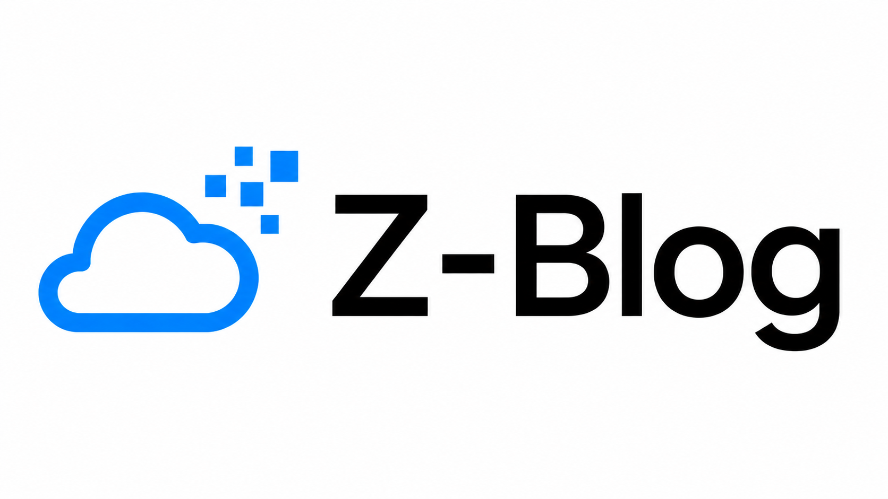
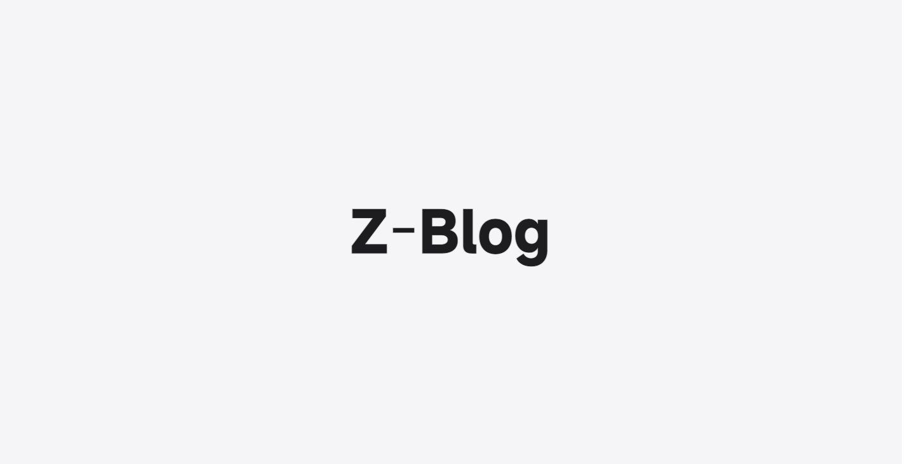
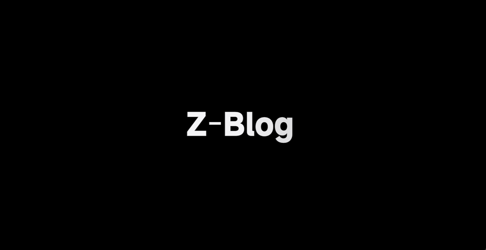
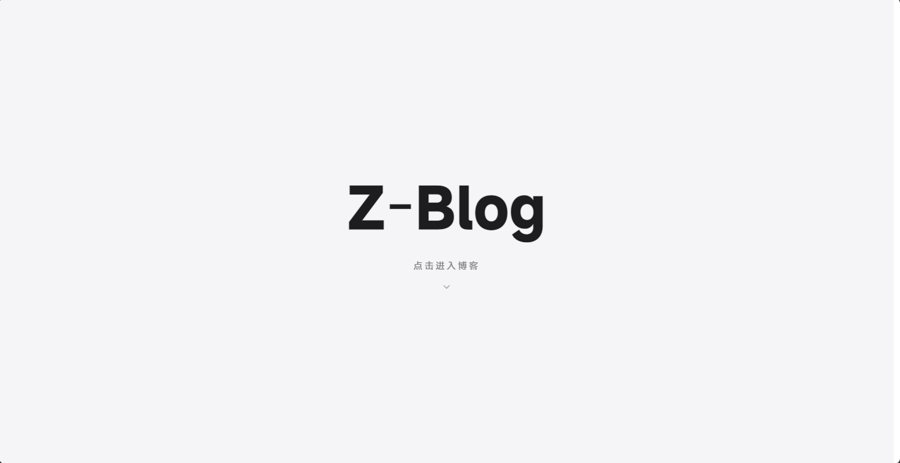
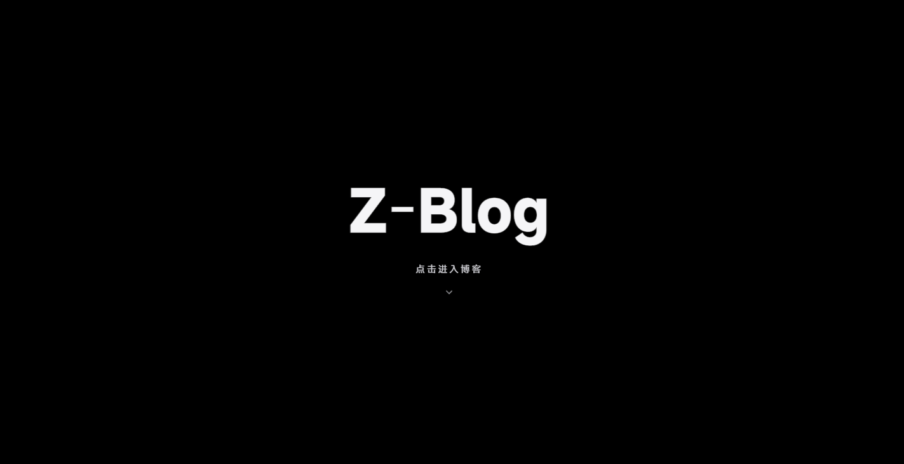
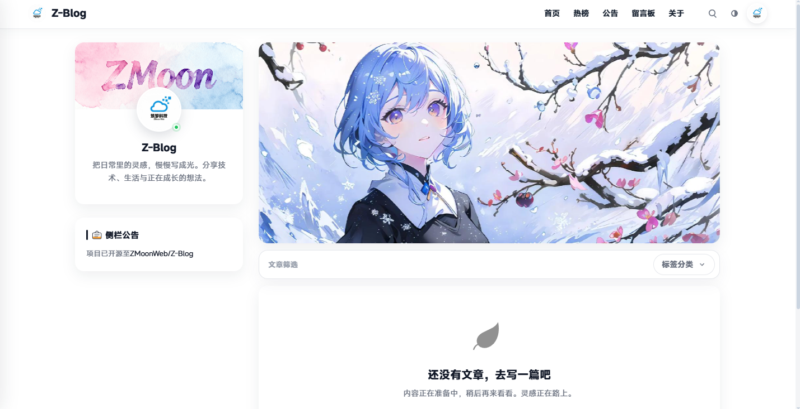
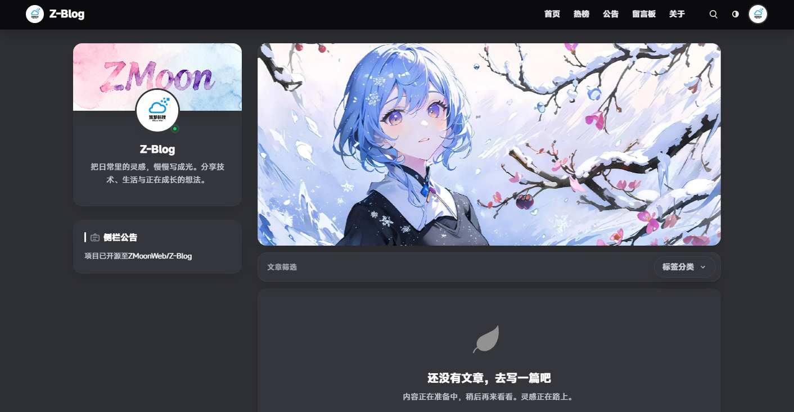
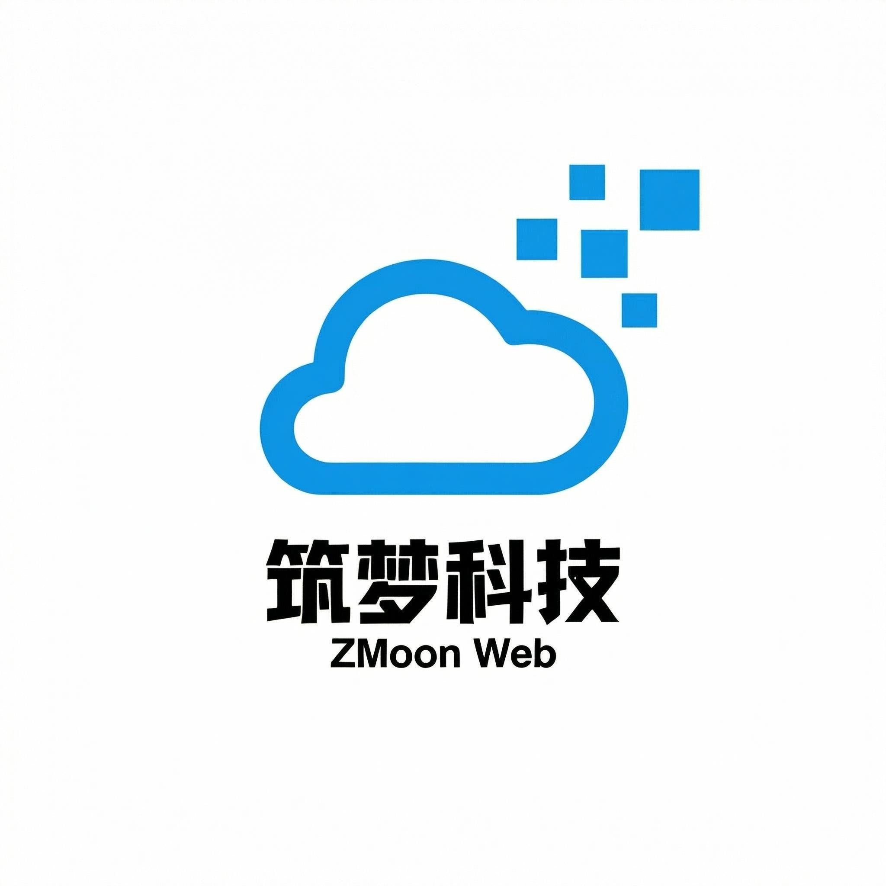

<p align="center">
  
</p>

<p align="center">
  <a href="./README.md">简体中文</a>
  <span> | </span>
  <a href="./README-zh-TW.md">繁體中文</a>
</p>

<p align="center">
  <a href="https://github.com/ZMoonWeb/Z-Blog/releases/latest"></a>&nbsp;&nbsp;&nbsp;
  <a href="https://github.com/ZMoonWeb/Z-Blog/blob/main/LICENSE"></a>&nbsp;&nbsp;&nbsp;
  <a href="https://github.com/ZMoonWeb/Z-Blog/stargazers"></a>&nbsp;&nbsp;&nbsp;
  <a href="https://github.com/ZMoonWeb/Z-Blog/network/members"></a>&nbsp;&nbsp;&nbsp;
  <a href="https://github.com/ZMoonWeb/Z-Blog/issues"></a>&nbsp;&nbsp;&nbsp;
  &nbsp;&nbsp;&nbsp;
  &nbsp;&nbsp;&nbsp;
  
</p>

## 简介

Z-Blog 是一个从零搭建的 PHP 博客系统，定位是轻量、现代、易部署。它包含前台阅读体验、后台内容管理、留言互动、公告管理、活动审计、站点个性化配置和版本更新检测，适合个人博客、作品记录、项目日志和小型内容站点。

项目不依赖大型框架，核心结构清晰，使用原生 PHP MVC 组织代码，并通过 Composer 管理必要依赖。

## 界面预览

**加载动画**

<p align="center">
  <span style="display: inline-block; width: 48%; text-align: center; vertical-align: top;">
    <br>
    <sub>浅色模式</sub>
  </span>
  <span style="display: inline-block; width: 48%; text-align: center; vertical-align: top;">
    <br>
    <sub>暗色模式</sub>
  </span>
</p>

**欢迎页**

<p align="center">
  <span style="display: inline-block; width: 48%; text-align: center; vertical-align: top;">
    <br>
    <sub>浅色模式</sub>
  </span>
  <span style="display: inline-block; width: 48%; text-align: center; vertical-align: top;">
    <br>
    <sub>暗色模式</sub>
  </span>
</p>

**首页**

<p align="center">
  <span style="display: inline-block; width: 48%; text-align: center; vertical-align: top;">
    <br>
    <sub>浅色模式</sub>
  </span>
  <span style="display: inline-block; width: 48%; text-align: center; vertical-align: top;">
    <br>
    <sub>暗色模式</sub>
  </span>
</p>
<h2 style="margin-top: 24px; margin-bottom: 0; padding-bottom: 0;">赞助商</h2>
<details style="margin-top: 0;"><summary><strong>想成为赞助商？点我了解</strong></summary>
欢迎通过邮件联系：<a href="mailto:3635716439@qq.com">3635716439@qq.com</a>
</details>
<br>
<table>
  <tr>
    <th align="left">图标</th>
    <th align="left">名称</th>
    <th align="left">简介</th>
    <th align="left">跳转</th>
  </tr>
  <tr>
    <td></td>
    <td>筑梦科技</td>
    <td>开发商</td>
    <td><a href="https://qm.qq.com/q/DYI7jJPTDq">点我了解详情</a></td>
  </tr>
</table>

## 功能特性

- 文章发布、编辑、删除、封面图、分类管理。
- 首页、热门、公告、留言板、关于页、个人主页和文章详情页。
- Markdown 渲染支持，基于 `league/commonmark`。
- 点赞、评论、留言等互动能力。
- 后台仪表盘、文章管理、分类管理、公告管理、留言管理。
- 管理员活动记录，后台关键操作会被记录。
- 前台设置、后台设置和个人资料分区管理。
- 图片上传、头像配置、站点 Logo、侧栏背景、个人主页背景等个性化配置。
- 安装向导、环境检测、数据库连接检测。
- 日志与缓存目录，便于部署后排查问题。
- 后台自动检测 GitHub 新版本，并提示前往下载。
- 明暗主题适配，内置 MiSans 字体资源。

## 技术栈

| 类型 | 说明 |
| --- | --- |
| 后端 | PHP 8.1+ |
| 数据库 | MySQL / MariaDB |
| 依赖管理 | Composer |
| 配置加载 | `vlucas/phpdotenv` |
| Markdown | `league/commonmark` |
| 前端 | 原生 HTML / CSS / JavaScript |
| 字体 | MiSans |

## 环境要求

- PHP `>= 8.1`
- MySQL 或 MariaDB
- Composer
- PHP 扩展：`pdo`、`pdo_mysql`、`mbstring`
- Web 服务器：Nginx、Apache、宝塔面板等均可

生产环境请将站点运行目录指向 `public/`。

## 快速开始

下载最新版发布包：

```text
https://github.com/ZMoonWeb/Z-Blog/releases/latest
```

将 ZIP 压缩包上传到服务器站点目录并解压。

配置站点域名，并将网站运行目录设置为：

```text
public
```

Nginx 伪静态配置：

```nginx
location / {
    try_files $uri $uri/ /index.php?$query_string;
}
```

创建配置文件：

```bash
cp .env.example .env
```

编辑 `.env`，至少填写数据库、站点地址、邮件和时区相关配置。

浏览器访问：

```text
https://你的域名/install
```

按照安装向导完成环境检测、数据库连接和管理员账号创建。

## 关键配置

| 配置项 | 说明 |
| --- | --- |
| `APP_NAME` | 应用名称 |
| `APP_VERSION` | 当前 Blog 版本号 |
| `APP_ENV` | 运行环境 |
| `APP_DEBUG` | 是否开启调试 |
| `APP_URL` | 站点地址 |
| `APP_TIMEZONE` | 默认时区 |
| `APP_UPDATE_CHECK_URL` | 更新检测接口地址 |
| `APP_UPDATE_RELEASE_URL` | 新版本跳转地址 |
| `DB_HOST` | 数据库主机 |
| `DB_DATABASE` | 数据库名称 |
| `DB_USERNAME` | 数据库用户名 |
| `DB_PASSWORD` | 数据库密码 |
| `MAIL_HOST` | SMTP 服务器 |
| `MAIL_USERNAME` | SMTP 用户名 |
| `MAIL_PASSWORD` | SMTP 密码 |
| `LOG_PATH` | 日志文件路径 |
| `LOG_REQUESTS` | 是否记录请求日志 |

实际部署时不要提交 `.env`，只提交 `.env.example` 作为模板。

## 目录结构

```text
Z-Blog/
├── app/                 # 应用核心、控制器、模型
├── config/              # 应用、数据库、日志、邮件配置
├── public/              # Web 根目录
│   ├── assets/          # 静态资源
│   ├── uploads/         # 用户上传目录
│   └── index.php        # 入口文件
├── resources/views/     # 页面模板
├── storage/             # 缓存、日志等运行时文件
├── vendor/              # Composer 依赖
├── .env.example         # 环境变量模板
├── composer.json        # Composer 配置
├── composer.lock        # 依赖锁定文件
└── install.php          # 安装向导
```

## 部署说明

1. 上传项目到服务器。
2. 执行 `composer install --no-dev --optimize-autoloader`。
3. 复制 `.env.example` 为 `.env` 并填写配置。
4. 将站点运行目录设置为 `public/`。
5. 确保 `storage/` 和 `public/uploads/` 可写。
6. 访问 `/install` 完成安装。

如果使用 Apache，项目已包含 `public/.htaccess`。如果使用 Nginx，请将请求重写到 `public/index.php`。

## 更新机制

后台首页会自动检查当前版本。检测到新版本时，管理员可以在提示弹窗中前往 GitHub 下载新版。

更新检测相关字段：

- 当前版本读取 `.env` 中的 `APP_VERSION`。
- 检测接口读取 `.env` 中的 `APP_UPDATE_CHECK_URL`。
- 跳转地址优先使用远端返回的 `release_url`，也可以通过 `APP_UPDATE_RELEASE_URL` 配置默认地址。

## 安全建议

- 不要提交 `.env`、日志文件、缓存文件和真实上传文件。
- 生产环境关闭 `APP_DEBUG`。
- 数据库账号建议使用最小权限。
- 后台账号请使用强密码。
- 定期备份数据库和 `public/uploads/`。
- 发布新版本前确认 `.env.example` 保持最新。

## 贡献

欢迎提交 Issue、建议和 Pull Request。提交代码前建议先确认：

- 代码风格与项目现有结构保持一致。
- 配置项同步更新 `.env.example`。
- 涉及数据库或安装流程的改动需要同步安装向导。
- 涉及后台操作的改动需要考虑活动记录。

## 许可证

Z-Blog 基于 [MIT License](LICENSE) 开源。
